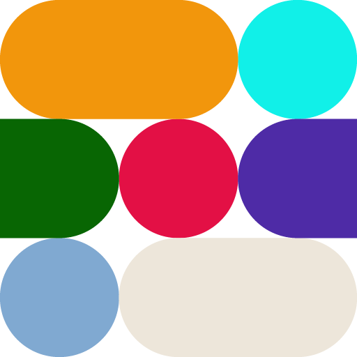

    

# A-Life Challenge
2022-2023 OSU Capstone Project

Depends on the JSON for Modern C++ library. You can download the `json.hpp` file from https://github.com/nlohmann/json/releases/tag/v3.11.2.

To set up the build, create a `UserBuild.txt` file in the project's directory and include the following line with the local path to the header file you downloaded:

> `SET(JSONHPP_DIR "C:/Users/{{path to folder containing json.hpp}}")`

To add new files to the CMake project, click the refresh button in the CMake panel in CLion.
Do not manually add files to the `add_executable()` in `CMakeLists.txt`.

## Building

We recommend building this project in JetBrains [CLion](https://www.jetbrains.com/clion/) IDE. Upon loading the project, CLion will recognize it as a CMake project. However, some configuration is needed for your build tools.

### Requirements

* [Ninja v1.11.1](https://github.com/ninja-build/ninja/releases/tag/v1.11.1)
* [CMake v3.26.4](https://github.com/Kitware/CMake/releases/tag/v3.26.4)
* MSVC via [Microsoft Visual Studio 2022](https://visualstudio.microsoft.com/vs/)

### Setting up Toolchains

* In CLion, go to `File -> Settings -> Build, Execution, Deployment -> Toolchains`.
* Add a Visual Studio toolchain.
* Set `Toolset:` to your visual studio install location if it is not already set.
* Set `CMake:` to the path to your installed CMake executable (CLion may give a warning saying the version is not supported).
* Set `Build Tool:` to the path to your installed Ninja executable.
* Ignore the `C Compiler:` field.
* `C++ Compiler:` should be automatically detected as `cl.exe` from your Visual Studio install.
