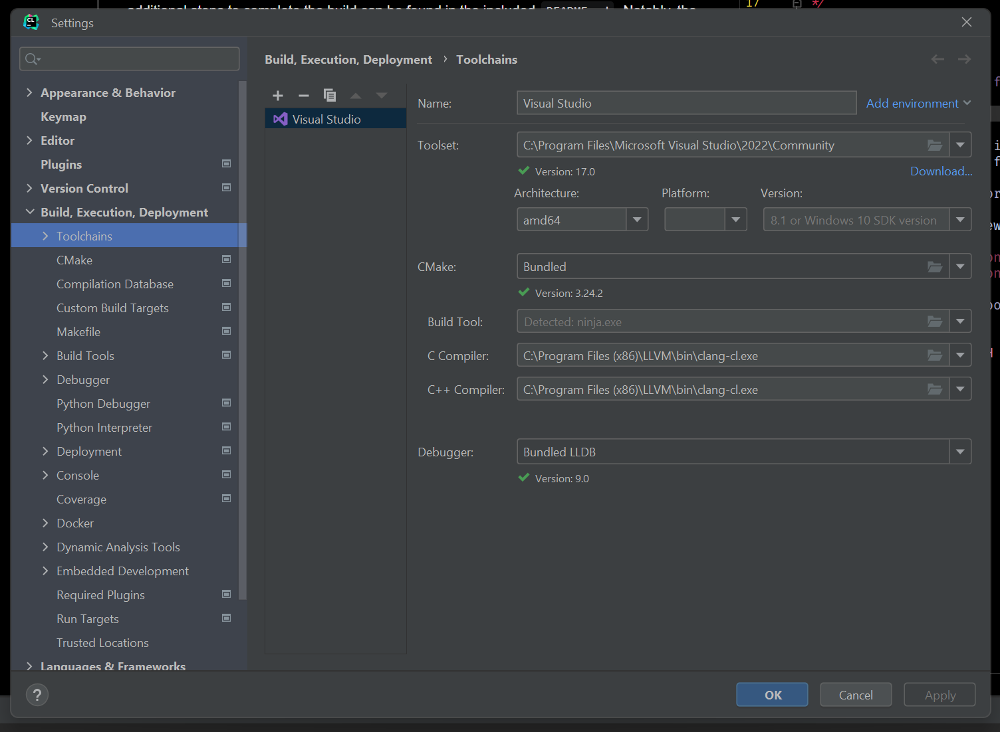
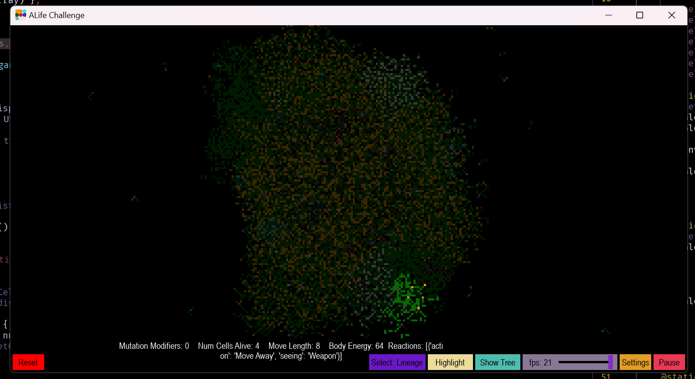

A-Life Challenge

* Anna Murphy
* Noah Hudkins
* Emmett Glaser

CS 462 Winter Term, 2023

# Alpha Instructions Document

Source code for the ALife project is available on [GitHub](https://github.com/murphan/ALife). The features in the status report can be found on the branch `main`. Clone this repo to your local computer with `git clone https://github.com/murphan/ALife`.

### ! This project can only be built on Windows !

The recommended IDE to build the project with is [Clion](https://www.jetbrains.com/clion/). Once cloned and opened in CLion, additional steps to complete the build can be found in the included `README.md`. Notably, the project depends on the [JSON for Modern C++ library](https://github.com/nlohmann/json/releases/tag/v3.11.2).

The project is split into a C++ side and a Python side. The source code for each can be found in `src/` and `pysrc/` respectively. Python 3.10 or lower is required due to PyGame being incompatible with Python 3.11.

This project uses the LLVM compiler for its C++ 20 support, which this project makes use of. LLVM for Windows can be found [here](https://github.com/llvm/llvm-project/releases/tag/llvmorg-15.0.7). To use the compiler in CLion, navigate to `Settings > Build, Execution, Deployment > Toolchains`. You should use the Visual Studio toolchain, but replace the C Compiler and C++ Compiler fields with the path to your installed `clang-cl.exe` from LLVM.


```1. Screenshot of correct CLion compiler settings```

Launching the project requires launching both the process built by C++, and the python process separately. They will connect to each other over localhost on port `51679`. Currently there is no interaction, only observation of the basic simulation.

When operating, the program should look like this:


```2. Screenshot of program running correctly```

## Quick Distribution

You can run the project without having to build it yourself. Just download the [alpha release](https://github.com/murphan/ALife/releases/tag/v0.0.0) on the GitHub page.

*document created with markdown. The original can be found [here](https://github.com/murphan/ALife/blob/alpha-instructions-doc/doc/instructions.md)*
